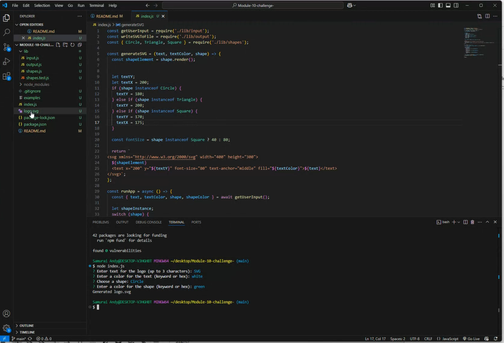

# SVG LOGO Generator!!! (Module-10 ) 

## Description

Welcome to SVG Logo Generator! If you need a quick and simple logo for your projects, this is the place! I am using Node.js to generate an SVG file based on your input, so you get a custom logo without needing a graphic designer.

It’s built using JavaScript and runs in the command line, where you can enter your own text (up to 3 characters), choose a shape (circle, triangle, or square), and pick colors for both the text and shape. Once you input your choices, an SVG file is created instantly with your custom logo.

So go ahead, run the app, enter your details, and get your logo in seconds! 

## Acceptance Criteria

GIVEN a command-line application that accepts user input

WHEN I am prompted for text

THEN I can enter up to three characters

WHEN I am prompted for the text color

THEN I can enter a color keyword (OR a hexadecimal number)

WHEN I am prompted for a shape

THEN I am presented with a list of shapes to choose from: circle, triangle, and square

WHEN I am prompted for the shape's color

THEN I can enter a color keyword (OR a hexadecimal number)

WHEN I have entered input for all the prompts

THEN an SVG file is created named `logo.svg`

AND the output text "Generated logo.svg" is printed in the command line

WHEN I open the `logo.svg` file in a browser

THEN I am shown a 300x200 pixel image that matches the criteria I entered 

## Installation
1. Create a GitHub repository.
2. Name it SVG Logo Maker (Module 10).
3. Clone it to my desktop.
4. Open it on VS Code and create a lib folder for input.js, output.js, and shapes.js.
5. Then, create the index.js file in the root directory.
6. Run npm init -y to generate package.json.
7. Install dependencies by running npm install inquirer jest.
8. Work on each file, starting with shapes.js, then input.js, output.js, and index.js.
9. Make sure they are linked to each other.
10. Test the shape classes using Jest with npm test.
11. Run the application using node index.js and check the generated logo.svg.
12. Create the README.md with installation and usage instructions.
13. After confirming everything works, push it to GitHub.

* Here is the video to show it functioning 
https://app.screencastify.com/v3/watch/hEEpShcwPn7R33NhTpuq

